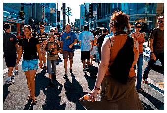

## Project_Image_Captioning
With the help of this project, machine can generate its own captions related to the image. The model uses Flickr dataset for training data and uses LSTM for training.
 
# One of example of final prediction:

 many people are standing around crowded street.
